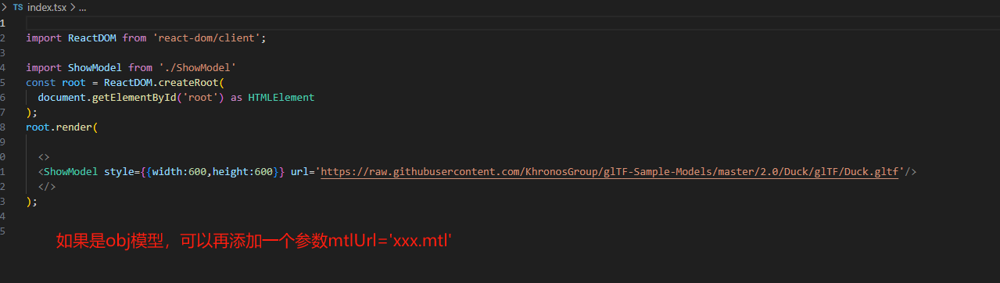

# 1.项目介绍
这是一个基于ts和react的3d模型展示组件，目前已经支持了gltf，glb，obj，stl，fbx
这是展示效果图


# 2. 使用




```JavaScript
1. git clone https://github.com/Wyh987654321/react-3dmodelShow.git
2.yarn
3.yarn start //如果报错，包缺少，就通过yarn add XXX 的方式下包即可
```
### 即可看到demo，如果觉得好用，麻烦点个star
